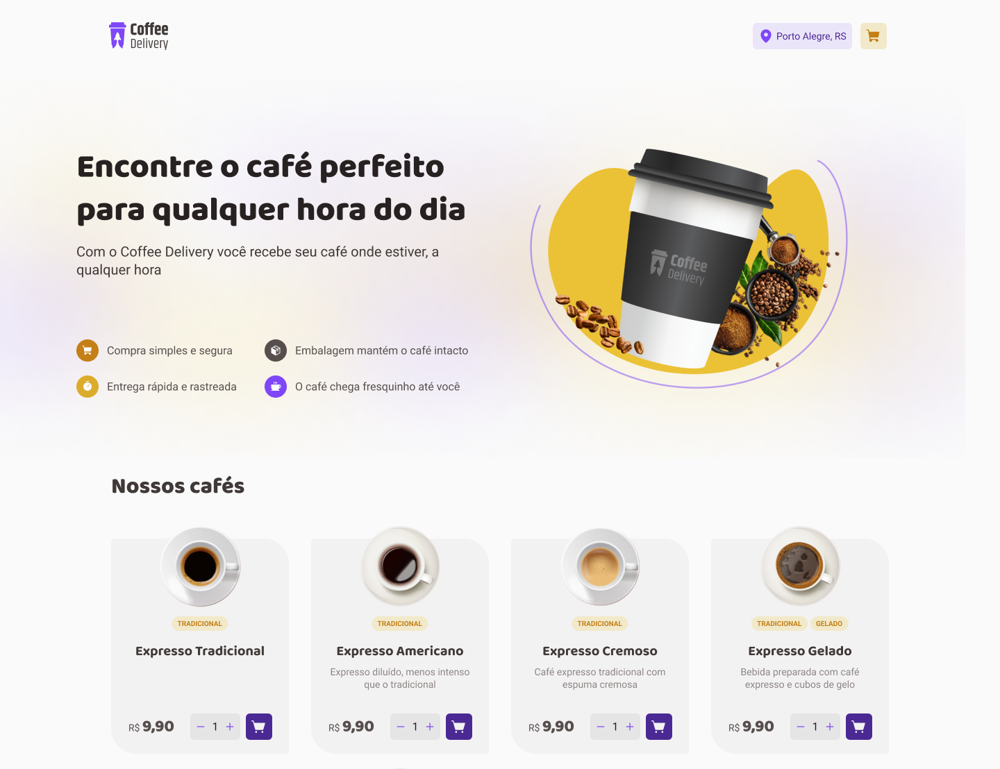

  

  <h1>Coffee Delivery</h1>

## 💻 Projeto

Coffee Delivery é uma aplicação que simula a gestão de um carrinho de compras de uma cafeteria fictícia proposta como desafio do Ignite na trilha de ReactJs da Rocketseat

## ✨ Tecnologias

- [React](https://reactjs.org/) 
- [TypeScript](https://www.typescriptlang.org/)
- [Styled Components](https://styled-components.com/)
- [React Hook Form](https://react-hook-form.com/)
- [Zod](https://zod.dev/)

## 🚀 Como executar

- Clone o repositório
- Rode `yarn` para baixar as dependências
- Rode o `yarn dev` para iniciar a aplicação.